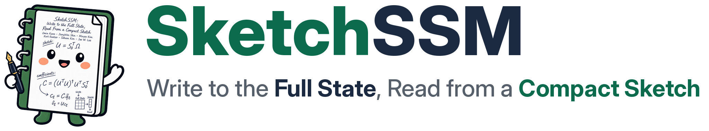
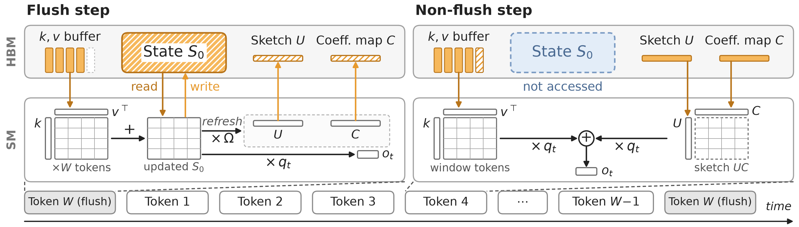
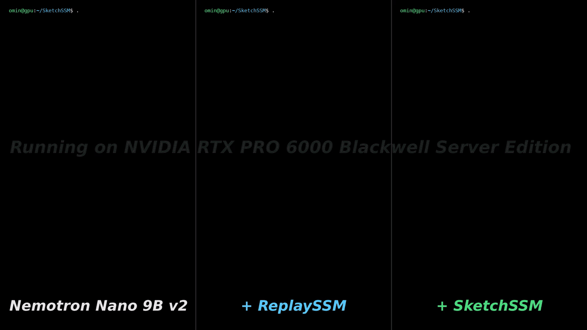
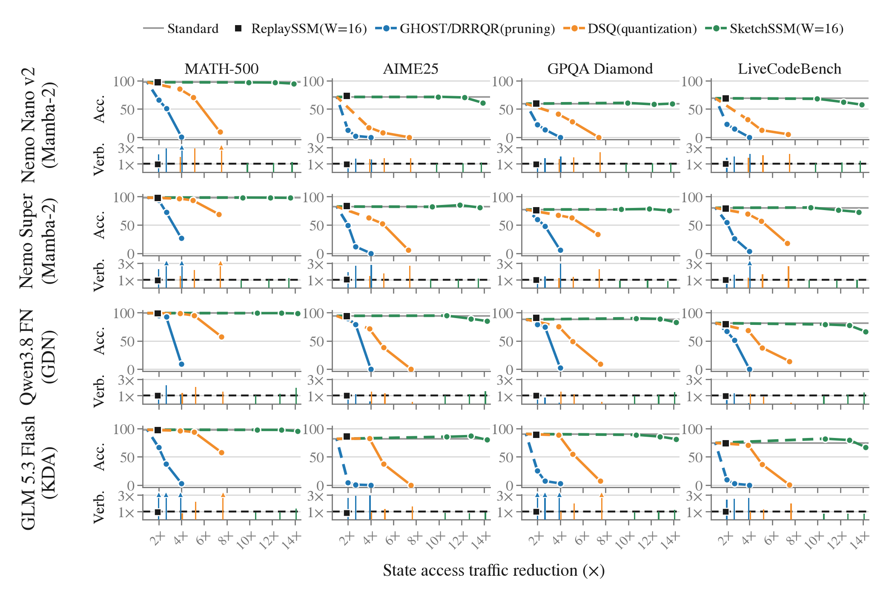
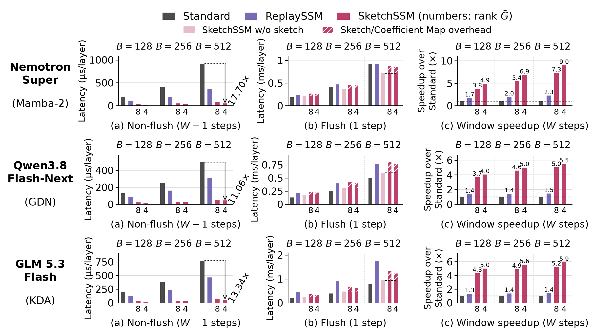

<p align="center">
  <picture>
    <source media="(prefers-color-scheme: dark)" srcset="assets/sketchssm-title-dark.png">
    
  </picture>
</p>

<p align="center">
  | <a href="https://omin-kwon.github.io/project/SketchSSM">🌐 Project Page</a>
  | <a href="https://arxiv.org/abs/2609.33051">📄 Paper</a>
  | <a href="https://huggingface.co/SketchSSM">🤗 Calibration Dataset</a>
  | <a href="https://pypi.org/project/sketchssm/">📦 PyPI</a> |
</p>

## Overview

Hybrid-attention models replace most softmax attention layers with linear
attention (Mamba-2, Gated DeltaNet, KDA), reducing KV-cache growth and enabling
larger decode batches, where recurrent-state access becomes a major bottleneck.
Reducing the state size by quantization or pruning cuts this traffic, but its
approximation errors propagate and accumulate through subsequent decode steps.
To reduce state-update traffic, ReplaySSM buffers keys and values over a window
of W steps and applies their accumulated updates to the full state once per
window. However, each new query still requires a full-state read, even though
the state remains unchanged between state updates.

SketchSSM keeps the full-state updates and approximates the reads:

- **Flush step** (every W steps): read the full state S<sub>0</sub> once, apply
  the buffered updates from the ring buffer, compute the compact sketch U from
  the updated state, and write back the state and the sketch.
- **Non-flush steps**: combine the sketch U and the coefficient map C with the
  query to reconstruct the output, without reading S<sub>0</sub>.

The sketching matrix is computed once per model by offline calibration. The
sketch size (the mean sketch rank per state head) is chosen as a serving
configuration and sets the trade-off between traffic reduction and accuracy. Across Mamba-2, GDN and KDA models, SketchSSM
at mean sketch rank 8 reduces state-access traffic by about 10x while matching the
average accuracy of the full-state baseline.

<p align="center">
  
</p>

## Demo

<p align="center">
  <a href="https://github.com/SNU-ARC/SketchSSM/blob/main/assets/sketchssm-demo.mp4"></a>
</p>

Nemotron Nano 9B v2 on one RTX PRO 6000 Blackwell decodes IFEval, MATH-500,
HumanEval and MBPP prompts (lm-eval, 4 samples each at T=0.6) as one stream at
batch 320, without and with ReplaySSM or SketchSSM (mean rank 8, W=16).
SketchSSM reaches 7,634 output tokens/s: 2.26x the baseline and 1.64x
ReplaySSM, with the same average accuracy (76.2 ± 1.0 vs 76.6 and 76.2, each
± 0.9). Prefill is computed ahead of time; the video shows decode at 8x speed.

This repository contains:

- [`vllm/`](https://github.com/SNU-ARC/SketchSSM/blob/main/vllm/README.md): vLLM v0.30.0 with SketchSSM.
- [`sketchssm/kernels/`](https://github.com/SNU-ARC/SketchSSM/blob/main/sketchssm/kernels/README.md): the SketchSSM CUDA decode kernels.
- [`sketchssm/calibration/`](https://github.com/SNU-ARC/SketchSSM/blob/main/sketchssm/calibration/README.md): the offline calibration.
- [`evaluation/`](https://github.com/SNU-ARC/SketchSSM/blob/main/evaluation/README.md): accuracy, decode throughput and per-layer linear-attention latency in vLLM.

## Installation

```bash
git clone https://github.com/SNU-ARC/SketchSSM.git
cd SketchSSM/vllm
VLLM_USE_PRECOMPILED=1 python -m pip install -e .
python -m pip install sketchssm   # CUDA kernels; without it vLLM uses its Triton kernels
```

## Quick start: serve with vLLM

SketchSSM needs a calibration file (`calibration.pt`) made by offline
calibration. Calibrations for the models below are on the [Hugging Face Hub](https://huggingface.co/SketchSSM).
To calibrate a new model yourself, see [`sketchssm/calibration/`](https://github.com/SNU-ARC/SketchSSM/blob/main/sketchssm/calibration/README.md).

<table>
<tr><th><sub>Model</sub></th><th><sub>Weights</sub></th><th><sub>Calibration</sub></th></tr>
<tr><td><sub>Nemotron Nano 9B v2-BF16</sub></td><td><sub><a href="https://huggingface.co/nvidia/NVIDIA-Nemotron-Nano-9B-v2">nvidia/NVIDIA-Nemotron-Nano-9B-v2</a></sub></td><td><sub><a href="https://huggingface.co/SketchSSM/Nemotron-Nano-9B-v2-BF16">SketchSSM/Nemotron-Nano-9B-v2-BF16</a></sub></td></tr>
<tr><td><sub>Nemotron 3 Super-NVFP4</sub></td><td><sub><a href="https://huggingface.co/nvidia/NVIDIA-Nemotron-3-Super-120B-A12B-NVFP4">nvidia/NVIDIA-Nemotron-3-Super-120B-A12B-NVFP4</a></sub></td><td><sub><a href="https://huggingface.co/SketchSSM/Nemotron-3-Super-NVFP4">SketchSSM/Nemotron-3-Super-NVFP4</a></sub></td></tr>
<tr><td><sub>Qwen3.8 Flash-Next-NVFP4</sub></td><td><sub><a href="https://huggingface.co/RadixArk/Qwen3.8-Flash-Next-NVFP4">RadixArk/Qwen3.8-Flash-Next-NVFP4</a></sub></td><td><sub><a href="https://huggingface.co/SketchSSM/Qwen3.8-Flash-Next-NVFP4">SketchSSM/Qwen3.8-Flash-Next-NVFP4</a></sub></td></tr>
<tr><td><sub>GLM 5.3 Flash-NVFP4</sub></td><td><sub><a href="https://huggingface.co/RedHatAI/GLM-5.3-Flash-NVFP4">RedHatAI/GLM-5.3-Flash-NVFP4</a></sub></td><td><sub><a href="https://huggingface.co/SketchSSM/GLM-5.3-Flash-NVFP4">SketchSSM/GLM-5.3-Flash-NVFP4</a></sub></td></tr>
<tr><td><sub>Qwen3.5 9B-BF16</sub></td><td><sub><a href="https://huggingface.co/Qwen/Qwen3.5-9B">Qwen/Qwen3.5-9B</a></sub></td><td><sub><a href="https://huggingface.co/SketchSSM/Qwen3.5-9B-BF16">SketchSSM/Qwen3.5-9B-BF16</a></sub></td></tr>
</table>

<sub>See [all calibrations](https://github.com/SNU-ARC/SketchSSM/blob/main/sketchssm/calibration/README.md#portable-calibration-file).</sub>

Enable SketchSSM with `--sketchssm` and a calibration, a Hub repo id or a local
file:

```bash
# Calibration from the Hub
vllm serve nvidia/NVIDIA-Nemotron-Nano-9B-v2 --trust-remote-code \
  --sketchssm SketchSSM/Nemotron-Nano-9B-v2-BF16 \
  --mamba-ssm-cache-dtype float32 --no-enable-prefix-caching

# Local calibration file
vllm serve nvidia/NVIDIA-Nemotron-Nano-9B-v2 --trust-remote-code \
  --sketchssm outputs/nano/calibration.pt \
  --mamba-ssm-cache-dtype float32 --no-enable-prefix-caching
```

Optionally, `--sketchssm-mean-rank` sets the rank budget, the mean sketch rank
per state head (default 8: about 10x less state traffic at accuracy comparable to the
full-state baseline).

See [`vllm/README.md`](https://github.com/SNU-ARC/SketchSSM/blob/main/vllm/README.md) for all options.

## Evaluation

<p align="center">
  
</p>

**Accuracy versus state access traffic** (paper, Figure 5). Accuracy on
MATH-500, AIME25, GPQA Diamond and LiveCodeBench for Nemotron Nano v2,
Nemotron 3 Super, Qwen3.8 Flash-Next and GLM 5.3 Flash, against the reduction
in state access traffic relative to Standard. At mean rank 8 (W=16, 9.4-10.7x
less state traffic), SketchSSM matches Standard's average accuracy on all four
models, while pruning (GHOST, DRRQR) and quantization (DSQ) lose accuracy at
much smaller reductions.

<p align="center">
  
</p>

**Linear-attention latency on one NVIDIA B300** (paper, Figure 7; W=16, batch
128, 256 and 512): (a) a non-flush step, (b) a flush step, (c) the speedup
over Standard across a whole window. At mean rank 8 and batch 512, SketchSSM is
7.30x faster than Standard on Nemotron 3 Super (Mamba-2), 5.02x on Qwen3.8
Flash-Next (GDN) and 5.24x on GLM 5.3 Flash (KDA), and 3.24x, 3.43x and 3.69x
faster than ReplaySSM.

See [`evaluation/`](https://github.com/SNU-ARC/SketchSSM/blob/main/evaluation/README.md) to measure a model's accuracy
(IFEval, MATH-500, HumanEval, MBPP), its decode throughput at a chosen batch
size, and the per-layer recurrent (linear-attention) decode latency in vLLM, and
[`sketchssm/kernels/`](https://github.com/SNU-ARC/SketchSSM/blob/main/sketchssm/kernels/README.md) for kernel tuning
and microbenchmarks.

## Citation

If you use SketchSSM in your research, please cite:

```bibtex
@misc{kwon2026sketchssmwritestateread,
  title={SketchSSM: Write to the Full State, Read from a Compact Sketch},
  author={Omin Kwon and JoongWon Shin and Minseo Kim and Kurt Keutzer and Sehoon Kim and Jae W. Lee},
  year={2026},
  eprint={2609.33051},
  archivePrefix={arXiv},
  primaryClass={cs.LG},
  url={https://arxiv.org/abs/2609.33051},
}
```

## License

SketchSSM is released under the [Apache License 2.0](https://github.com/SNU-ARC/SketchSSM/blob/main/LICENSE). The
[`vllm/`](https://github.com/SNU-ARC/SketchSSM/blob/main/vllm/) directory is a fork of vLLM, also under Apache-2.0. Calibration
files are derived from the base models' weights and are also subject to those
models' licenses.
