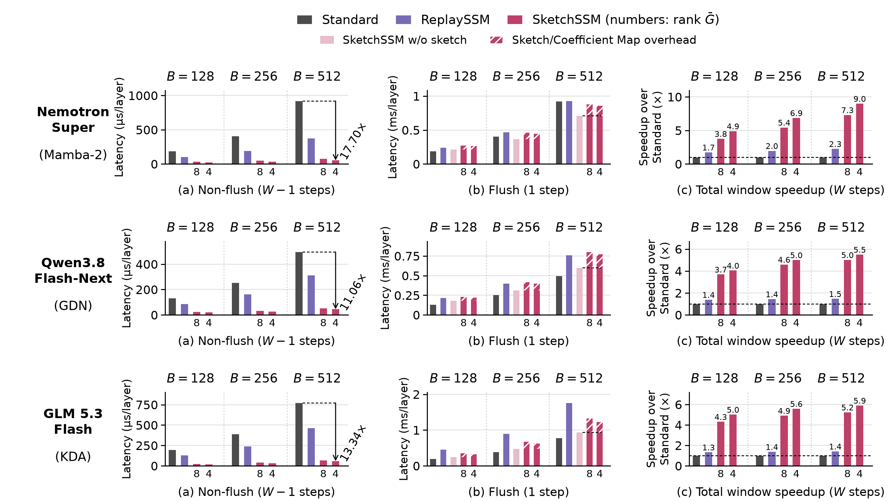
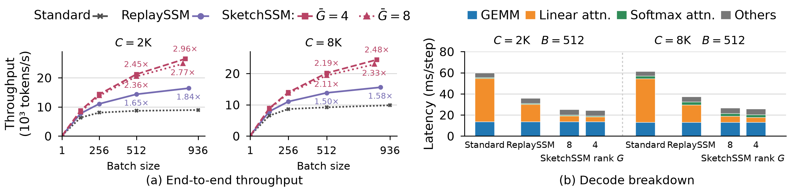

# Figures 7 and 8 on one B300

Per-layer decode latency of the recurrent (linear-attention) kernels of
Nemotron 3 Super (Mamba-2), Qwen3.8 Flash-Next (GDN) and GLM 5.3 Flash (KDA)
on one NVIDIA B300, W=16, batch 128, 256 and 512, SketchSSM at mean rank 8
and 4. Kernels only: no model weights are loaded.



(a) Non-flush step, (b) flush step (hatch: the sketch and coefficient-map
construction over the same flush without it, at G=4), (c) the window of 15
non-flush steps and one flush step as a speedup over Standard (16 full-state
updates). `figures/combined-kernel-speedup.*` is the paper layout, with (c)
as window latency.

## Results at batch 512

| model | Standard | ReplaySSM | SketchSSM G=8 | SketchSSM G=4 | flush construction overhead (G=8 / G=4) |
| --- | --- | --- | --- | --- | --- |
| Nemotron 3 Super (Mamba-2) | 1x | 2.26x | 7.30x | 8.99x | +23.7% / +20.3% |
| Qwen3.8 Flash-Next (GDN) | 1x | 1.46x | 5.02x | 5.50x | +31.7% / +28.6% |
| GLM 5.3 Flash (KDA) | 1x | 1.42x | 5.24x | 5.90x | +39.3% / +31.6% |

Window speedup over Standard. All cells, batch sizes and per-round times are
in `results/`; `data/summary.json` has the speedups.

## Method

- **Layers.** Every recurrent layer (Super 40, Qwen 36, GLM 34) gets its own
  state, rings and sketch, with the calibration's per-layer ranks and frames at
  mean rank G (`load_sketchssm_calibration(repo, G, 16)`, as vLLM loads it).
- **Timing.** One CUDA graph holds one decode step of all layers for a phase.
  Every row is at window position 5 (non-flush) or 15 (flush). The graph is
  replayed 3 times to warm up, then timed over 6 replays; the reported value is
  the median of 5 captures, divided by the layer count.
- **Non-flush step.** A step without flush rows launches no flush kernel, as
  the package's benchmark tools do. (Under one full CUDA graph for all steps,
  vLLM launches the flush every step and it exits at once; with requests spread
  over the window, every step has flush rows.)
- **Super state placement.** Mamba-2 states sit as vLLM's hybrid KV pool holds them
  (`benchmark_mamba2.pool_state`): one page per block (Standard 4,259,840 B, padded
  to the attention page; ReplaySSM/SketchSSM 4,562,944 B with the rings), the
  state after the conv state, six blocks per request (five Mamba groups and the
  attention group), layer j of every group sharing one pool tensor. Standard's
  page makes the states of a layer 128 KiB x 195 apart, which crowds them onto
  few DRAM channels: `selective_state_update` takes 919 us/layer at B=512 here
  (892-956 over allocations; 1,023-1,027 in the model) against 659 us for one
  contiguous tensor (`--contiguous-state`). ReplaySSM and SketchSSM are unchanged.
- **Standard.** vLLM's full-state decode. Super uses the B300
  `selective_state_update` config in `configs/selective_state_update/`
  (vLLM ships none for B300; tuned with
  `benchmarks/kernels/benchmark_selective_state_update.py`), 1.67x faster
  than the default launch config.
- **ReplaySSM.** Super: vLLM's ReplaySSM kernel. Qwen: the ReplaySSM authors'
  Triton kernel (Johnny-Liou/ReplaySSM, `fused_recurrent_gated_delta_rule_replayssm`
  in the vLLM fork). GLM: the fork's KDA ReplaySSM kernels with the window
  bookkeeping (`kda_bookkeeping.py`, O(B + P)) run once per step for all
  layers.
- **Construction overhead.** The `control` arm builds the same flush with the
  sketch and coefficient-map construction compiled out (timing only):
  Mamba-2 `FL_DENSE=1 FL_DENSE_KEYMAJOR=1`, GDN `W1_NOSKETCH=1`, KDA
  `K1_ABLATE=12`.

## Figure 8: Nemotron 3 Super end-to-end decode



(a) Decode throughput (model-forward time per step) at C=2K and 8K up to each
arm's capacity endpoint; numbers are the speedup over Standard at B=512 and at
each arm's own maximum batch. (b) The profiled decode step at B=512.

| C | Standard (B_max) | ReplaySSM | SketchSSM G=8 | SketchSSM G=4 |
| --- | --- | --- | --- | --- |
| 2K | 936: 8,952 tok/s | 872: 1.84x | 832: 2.77x | 848: 2.96x |
| 8K | 936: 9,850 tok/s | 872: 1.58x | 832: 2.33x | 848: 2.48x |

Speedup of each arm's endpoint throughput over Standard's.

- **Engine.** The vLLM fork (Model Runner V2 for every arm), FP32 SSM state,
  util 0.95, no prefix caching, the default hybrid KV layout,
  max_model_len = C + 128. All arms share one FlashInfer autotune result
  (`VLLM_FLASHINFER_AUTOTUNE_CACHE_KEY`), so GEMM/MoE kernels are identical.
- **Cohort.** B random-token prompts of C tokens enter decode together
  (`e2e/barrier.py`); 128 output tokens; per step = mean model-forward GPU time
  over decode steps 16-111 (six windows). One run per point (two for Standard at 2K, averaged).
- **Capacity endpoint.** (KV blocks - 1) // 6, rounded down to a multiple of 8.
  SketchSSM keeps its sketches outside the KV pool, sized by max_num_seqs, so
  each arm runs with max_num_seqs just above its endpoint (Standard 944/960,
  ReplaySSM 880, G=8 840, G=4 856).
- **Breakdown.** One nsys capture per arm at B=512 (`e2e/trace.py`): GEMM,
  linear attention, softmax attention, and the rest of the GPU span.

## Reproduce

With the vLLM fork (`vllm/`) and this package installed, on a B300:

```bash
cd evaluation/b300
for f in mamba2 gdn kda; do
  python kernel_latency.py --family $f --arm standard  --out results/${f}_standard.json
  python kernel_latency.py --family $f --arm replayssm --out results/${f}_replayssm.json
  for g in 8 4; do
    python kernel_latency.py --family $f --arm sketch  --g $g --out results/${f}_sketch_g$g.json
    python kernel_latency.py --family $f --arm control --g $g --out results/${f}_control_g$g.json
  done
done
python make_data.py              # data/ and data/summary.json (no GPU)
python render_figure7_speedup.py # figures/combined-kernel-speedup-panelc-speedup.*
python render_figure7.py         # figures/combined-kernel-speedup.*
```

Figure 8 (Super checkpoint, vLLM fork; from `evaluation/b300`):

```bash
for c in 2048 8192; do
  python e2e/decode.py --model super --arm standard  --context $c --batches 1,128,256,512 --endpoint --max-seqs 960 --out e2e_runs/sweep_standard_c$c.json
  python e2e/decode.py --model super --arm replayssm --context $c --batches 1,128,256,512 --endpoint --max-seqs 880 --out e2e_runs/sweep_replayssm_c$c.json
  python e2e/decode.py --model super --arm sketch --g 8 --context $c --batches 1,128,256,512 --endpoint --max-seqs 840 --out e2e_runs/sweep_g8_c$c.json
  python e2e/decode.py --model super --arm sketch --g 4 --context $c --batches 1,128,256,512 --endpoint --max-seqs 856 --out e2e_runs/sweep_g4_c$c.json
done
# panel (b): nsys profile --trace=cuda,nvtx --cuda-graph-trace=node --capture-range=cudaProfilerApi \
#   python e2e/decode.py ... --batches 512 --max-seqs 512 --profile; then e2e/trace.py extract / analyze
python make_data_figure8.py && python render_figure8.py   # results/e2e -> data/, figures/super-e2e-speedup.*
```

The calibrations come from the Hugging Face Hub; the KDA ReplaySSM arm builds
`kda_bookkeeping.py` with `torch.utils.cpp_extension` (nvcc and ninja).
